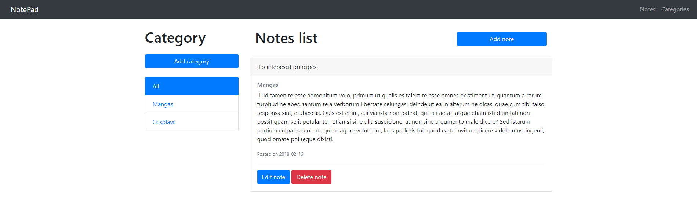
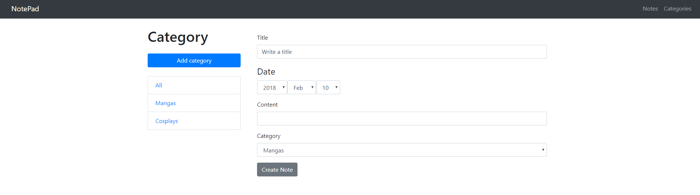
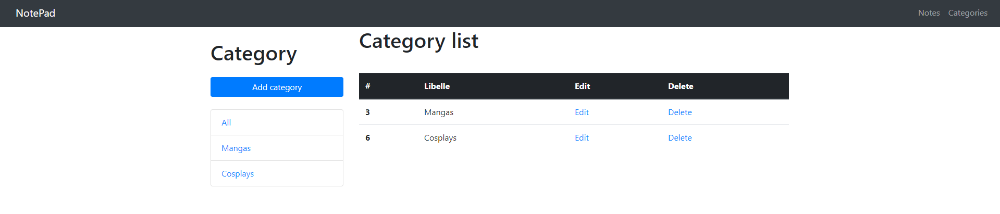
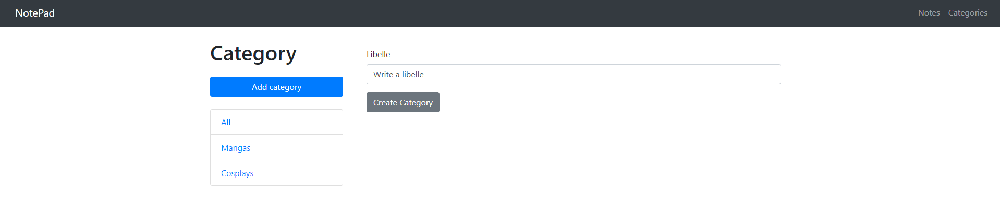

# NotePad application
School assignment written in Symfony 4.

### The project
The project is an application that allows you to encode notes.
The note has:
* an id
* a date
* a title
* content

It is necessary to be able to :
* list
* create
* edit
* delete a note.

A note is associated with a category.

A category has:
* an id
* a label
You must be able to list, create, edit or delete a category.

#### Screenshot





### Install

1. **requirements:**
    - php 7.1 or higher
    - git
    - composer
    - npm or yarn
    - mysql
2. **clone:**
   ```
   git clone https://github.com/bluebeel/ecam4in-sf-notepad.git
   cd ecam4in-sf-notepad
   ```
3. **Install dependencies**
   ```
   npm install
   ```
   if you use yarn
   ```
   yarn install
   ```
   Then install symfony dependencies
   ```
   composer install
   ```
4. **Run**
    ```
    php bin/console server:run
    ```
